```mermaid
graph TD
    User[👤 User] --> Query[Research Query]
    Query --> Planner[📝 Planner]
    Planner --> Searcher[🔍 Searcher]
    Searcher --> Summarizer[📖 Summarizer]
    Summarizer --> Reviewer[🔍 Reviewer]
    Reviewer --> Writer[✍️ Writer]
    Writer --> Report[📄 Final Report]
    
```

# OrchestrateAI - Multi-Agent Research Agency

## About This Project
As part of my journey to learn the latest in AI, I set out to build a real-world system that goes beyond simple chatbots. OrchestrateAI is my hands-on exploration of agentic AI—where multiple specialized agents collaborate, use live web tools, and synthesize information to solve complex research tasks. This project demonstrates my ability to design, implement, and deploy advanced AI workflows using modern tools and APIs.

## Project Overview
OrchestrateAI is an autonomous multi-agent system that functions as a digital research agency. It takes a user query and orchestrates a team of specialized AI agents to produce a comprehensive, fact-grounded report, leveraging live web data and advanced LLMs.

## Features
- **Agentic Orchestration:** Specialized agents (Planner, Searcher, Summarizer, Reviewer, Writer) collaborate in a coordinated workflow.
- **Live Web Search with Exa API:** The Searcher agent uses the Exa API to access and extract current, real-world information from the web.
- **Multi-LLM Synthesis:** Agents use multiple LLMs with large context windows for richer, less-compressed synthesis.
- **Comprehensive Reports:** Aggregates multiple sources per task, including detailed summaries and large excerpts, formatted with Markdown headings and bullet points.
- **Automated Quality Assurance:** Reviewer agent checks source reliability and identifies key claims.
- **Performance Optimizations:** Smart rate limiting, efficient token usage, and robust error handling.

## Orchestration Workflow
- **Query:** User submits a research topic.
- **Planning:** Planner agent creates a structured research plan.
- **Search:** Searcher agent performs targeted web searches (multiple results per task) using Exa API.
- **Analysis:** Summarizer and Reviewer extract insights and evaluate reliability, including detailed summaries and excerpts.
- **Synthesis:** Writer agent produces a well-structured, Markdown-formatted report.
- **Delivery:** Final report is presented to the user.

## Tech Stack
- **Python** (core logic, agents)
- **LangGraph** (stateful agent workflow)
- **OpenAI GPT-3.5-turbo** (LLM)
- **Exa API** (live web search and content extraction)
- **FastAPI** (backend API)
- **Next.js 14 + TypeScript + Tailwind CSS** (frontend)
- **python-dotenv** (environment management)

## Quick Start
1. Clone the repository
2. Set up environment variables in `backend/.env` (including your Exa API key)
3. Install backend dependencies: `pip install -r backend/requirements.txt`
4. Install frontend dependencies: `cd frontend && npm install`
5. Run backend: `uvicorn app.main:app --reload`
6. Run frontend: `npm run dev`

---

**Built with Exa API for live, reliable web search.**
