# OrchestrateAI - A Multi-Agent Research Agency

 

## Introduction: My Journey into Agentic AI

As part of my journey learning about the cutting edge of AI, I wanted to move beyond simple chatbots and build something that truly embodies the principles of **agentic AI**. The goal wasn't just to create a tool, but to understand how to design systems where multiple AI agents can collaborate, use tools, and work with human oversight to solve complex problems.

**OrchestrateAI** is the result of that exploration. It's an autonomous multi-agent system designed to function like a digital research agency. It takes a single query from a user and orchestrates a team of specialized AI agents to produce a comprehensive, fact-grounded report. This project is my hands-on implementation of concepts like task decomposition, tool-use, and human-in-the-loop validation using LangGraph and modern AI APIs.

## Core Objective & What I'm Showcasing

This project was built to demonstrate a practical understanding of several key concepts in modern AI engineering:

1.  **Agentic Orchestration**: The heart of the project. I'm showcasing the ability to build a system where specialized agents work together in a coordinated workflow, each handling specific aspects of the research process. This is the "Orchestrate" in OrchestrateAI.

2.  **Tool-Augmented Generation**: I've moved beyond the limitations of static LLMs by giving my agents tools. The Searcher uses the **Exa API** to access live web data, ensuring the output is grounded in real, verifiable information.

3.  **Quality Assurance & Reliability**: The system includes automated review processes where the Reviewer agent evaluates source reliability and identifies key claims, ensuring high-quality outputs.

4.  **Stateful, Cyclical Workflows**: Using `LangGraph`, the system maintains a persistent state across multiple steps. The workflow is not a simple one-way pipeline; it's a dynamic graph that can handle complex, multi-step research tasks.

5.  **End-to-End Application Development**: I've brought this entire system to life with a modern **Next.js frontend** and **FastAPI backend**, proving I can bridge the gap between a complex AI system and a user-friendly interface.

## The Orchestration Workflow

OrchestrateAI operates through a clear, structured process managed by a stateful graph:

- **Query**: A user submits a research topic.
- **Planning**: The `Planner` agent creates a structured research plan with 3-5 actionable tasks.
- **Search**: The `Searcher` agent performs targeted web searches using Exa API for current information.
- **Analysis**: The `Summarizer` and `Reviewer` agents work together to extract insights and evaluate reliability.
- **Synthesis**: The `Writer` agent synthesizes all findings into a comprehensive, well-formatted report.
- **Delivery**: The final report is presented to the user.

```mermaid
graph TD
    User[👤 User] --> Query[Research Query]
    Query --> Planner[📝 Planner]
    Planner --> Searcher[🔍 Searcher]
    Searcher --> Summarizer[📖 Summarizer]
    Summarizer --> Reviewer[🔍 Reviewer]
    Reviewer --> Writer[✍️ Writer]
    Writer --> Report[📄 Final Report]
    
```

## Technologies Used

*   **Core Logic**: Python
*   **Agent Framework**: `LangGraph`
*   **LLM**: `OpenAI GPT-3.5-turbo`
*   **External Tools**: `Exa API` for web search and content extraction
*   **Backend**: `FastAPI` with automatic API documentation
*   **Frontend**: `Next.js 14` with TypeScript and Tailwind CSS
*   **Environment**: `python-dotenv`

## Key Features & Improvements

### Intelligent Rate Limiting
- Built-in retry mechanisms with exponential backoff
- 2-second delays between API calls to prevent quota issues
- Sequential processing to avoid overwhelming external APIs

### Quality Assurance
- Automated source reliability checking
- Structured review process for all content
- Intelligent parsing and validation of agent outputs

### Performance Optimizations
- Optimized token usage (800-1500 tokens per agent)
- Smart content chunking (4000 characters)
- Efficient search result processing (3 results per task)

### Modern Architecture
- RESTful API with automatic documentation
- Type-safe frontend with modern React patterns
- Comprehensive error handling and logging

## What I Learned

Building OrchestrateAI was an incredible learning experience. I moved from theoretical knowledge to practical application in areas like:

- **Rate Limiting & API Management**: Understanding how to build robust systems that work within API constraints
- **Multi-Agent Coordination**: Designing systems where multiple specialized agents work together effectively
- **Error Handling & Reliability**: Implementing retry mechanisms and graceful degradation
- **Modern Web Development**: Building full-stack applications with modern frameworks
- **Performance Optimization**: Balancing functionality with efficiency and cost

## Getting Started

### Prerequisites
- Python 3.8+
- Node.js 18+
- OpenAI API key
- Exa API key

### Quick Start
1. Clone the repository
2. Set up environment variables in `backend/.env`
3. Install backend dependencies: `pip install -r backend/requirements.txt`
4. Install frontend dependencies: `cd frontend && npm install`
5. Run backend: `uvicorn app.main:app --reload`
6. Run frontend: `npm run dev`

For detailed setup instructions, see the [backend README](backend/README.md).